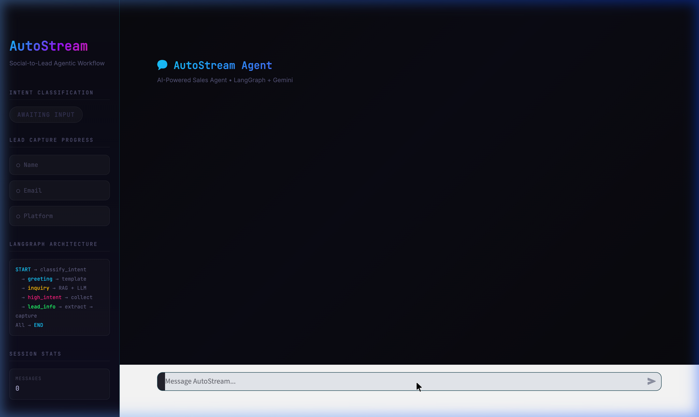

# 🎬 AutoStream — Social-to-Lead Agentic Workflow

> A production-grade conversational AI agent that qualifies social media leads through natural conversation — powered by a **6-node LangGraph state machine** and **Gemini 1.5 Flash**.

<p align="center">
  
</p>

## 📋 Table of Contents

- [Quick Start](#-quick-start)
- [Pre-Flight Checklist](#-pre-flight-checklist)
- [Architecture](#-architecture)
- [How It Works](#-how-it-works)
- [RAG Implementation](#-rag-implementation)
- [Streamlit UI](#-streamlit-ui)
- [WhatsApp Integration](#-whatsapp-integration)
- [Project Structure](#-project-structure)

---

## 🚀 Quick Start

```bash
# 1. Clone & install
git clone https://github.com/YOUR_USERNAME/servicehive-assignment.git
cd servicehive-assignment
pip install -r requirements.txt

# 2. Set API key
export GOOGLE_API_KEY="your_gemini_api_key"

# 3. Launch UI
streamlit run app.py

# Or run in terminal
python3 main.py
```

## ✅ Pre-Flight Checklist

Use this checklist right before recording:

- [ ] `pip install -r requirements.txt` completes without errors
- [ ] `GOOGLE_API_KEY` is set in the same terminal where Streamlit runs
- [ ] `streamlit run app.py` starts and opens UI
- [ ] Conversation memory persists across at least 5-6 turns
- [ ] Intent badge changes correctly (`greeting` → `product_inquiry` → `high_intent` / `lead_info`)
- [ ] RAG response includes correct plan details from `knowledge_base.json`
- [ ] Lead capture is progressive (name → email → platform)
- [ ] `mock_lead_capture()` fires only after all 3 fields are collected
- [ ] No `🚨 API ERROR` appears during your final demo


## 🏗️ Architecture

### Multi-Node LangGraph State Machine

The agent uses a **6-node `StateGraph`** with **conditional edges** — a proper agentic architecture with real LLM-based intent classification.

```
                         ┌──────────────┐
                         │    START     │
                         └──────┬───────┘
                                │
                         ┌──────▼───────┐
                         │  classify    │  ← LLM reasons about
                         │  _intent     │    user intent
                         └──────┬───────┘
                                │
              ┌─────────────────┼─────────────────┐
              │                 │                 │
        ┌─────▼──────┐   ┌─────▼──────┐   ┌──────▼───────┐
        │  handle    │   │  handle    │   │   handle     │
        │  greeting  │   │  rag       │   │   lead       │
        │  (LLM)     │   │  (LLM+KB) │   │  collection  │
        └─────┬──────┘   └─────┬──────┘   └──────┬───────┘
              │                │                  │
              ▼                ▼           ┌──────▼───────┐
            [END]            [END]         │  extract     │
                                           │  lead_info   │
                                           │  (regex)     │
                                           └──────┬───────┘
                                                  │
                                       ┌──────────┼──────────┐
                                       │                     │
                                 ┌─────▼──────┐       ┌─────▼────────┐
                                 │  lead      │       │  lead        │
                                 │ collection │       │  capture     │
                                 │(next field)│       │  (TOOL!) 🎯  │
                                 └─────┬──────┘       └─────┬────────┘
                                       │                    │
                                       ▼                    ▼
                                     [END]                [END]
```

### Why This Architecture?

| Decision | Rationale |
|----------|-----------|
| **6 separate nodes** | Each node has a single responsibility — proper separation of concerns |
| **LLM intent classification** | Model reasons about intent through structured prompts, not keyword matching |
| **Conditional edges** | LangGraph routes dynamically based on the LLM's classification |
| **Regex field extraction** | Names/emails/platforms are deterministic — no API call needed |
| **Assertion guard** | `mock_lead_capture()` only fires after all 3 fields are verified |

### API Budget Per Turn

| Turn Type | LLM Calls | Method |
|-----------|-----------|--------|
| Greeting | 2 | classify (LLM) → respond (LLM) |
| Product Q&A | 2 | classify (LLM) → RAG + LLM |
| High Intent | 1 | classify (LLM) → template |
| Name / Email / Platform | 0 | Fast-path → regex |
| Lead Capture | 0 | Tool execution |

**Full 6-turn demo: ~5 API calls total.**

---

## ⚙️ How It Works

### Intent Classification (Node 1)

The `classify_intent` node sends the user's message to the LLM with a structured classification prompt and a strict Pydantic schema:

```python
class IntentClassification(BaseModel):
    intent: str = Field(
        description="Must be exactly one of: greeting, product_inquiry, or high_intent"
    )

structured_llm = llm.with_structured_output(IntentClassification)
```

Conditional edges route to the correct handler node based on validated structured output.

### Progressive Lead Capture (Nodes 4-6)

When high intent is detected, the agent enters a **stateful collection loop**:

1. `handle_lead_collection` → asks for the next missing field (name → email → platform)
2. `extract_lead_info` → extracts the field using regex/string parsing (zero LLM calls)
3. `check_lead_complete` → conditional edge checks if all 3 fields are present
4. If incomplete → loops back to step 1
5. If complete → `handle_lead_capture` fires `mock_lead_capture()` with assertion guard

---

## 🔍 RAG Implementation

### TF-IDF with N-gram Vectorization

```python
TfidfVectorizer(
    stop_words="english",
    ngram_range=(1, 2),     # Unigram + bigram phrase matching
    max_features=5000,
)
```

The knowledge base is a structured JSON file with product data, pricing, policies, and FAQs. Each section is flattened into searchable text chunks with source metadata.

**Why TF-IDF?**
- **Zero infrastructure** — no vector database, no embedding API calls
- **Deterministic** — same query always returns same results
- **N-gram overlap** — captures phrase semantics ("Pro plan", "video editing")
- **Source transparency** — each chunk carries metadata (pricing/policy/FAQ) exposed in the UI

---

## 🎨 Streamlit UI

The agent ships with a **cyberpunk-themed chat interface** built with custom CSS:

### Features
- **Intent Classification Badge** — Color-coded pill that updates in real-time (cyan = greeting, yellow = inquiry, magenta = high intent, green = lead collection)
- **Lead Capture Progress Stepper** — Visual timeline tracking name → email → platform with ✅/⏳/○ states
- **RAG Source Viewer** — Expandable `[📡 View RAG Sources]` panel showing retrieved knowledge chunks
- **Terminal-Style Lead Capture** — Mock CRM payload display when `mock_lead_capture()` fires
- **LangGraph Architecture** — Live state machine diagram in the sidebar

### Run
```bash
export GOOGLE_API_KEY="your_key"
streamlit run app.py
```

---

## 📱 WhatsApp Integration

To deploy on WhatsApp for real social-to-lead conversion:

```python
from fastapi import FastAPI, Request
from agent import AutoStreamAgent

app = FastAPI()
sessions: dict[str, AutoStreamAgent] = {}

@app.post("/webhook")
async def handle_message(request: Request):
    data = await request.json()
    phone = data["entry"][0]["changes"][0]["value"]["messages"][0]["from"]
    text = data["entry"][0]["changes"][0]["value"]["messages"][0]["text"]["body"]

    if phone not in sessions:
        sessions[phone] = AutoStreamAgent()

    response = sessions[phone].run(text)
    send_whatsapp_message(phone, response)
    return {"status": "ok"}
```

Deploy on **Railway** or **Render** with a public HTTPS endpoint.

---

## 📁 Project Structure

```
servicehive-assignment/
├── app.py                ← Streamlit UI (cyberpunk chat interface)
├── main.py               ← Terminal REPL entry point
├── agent.py              ← Multi-node LangGraph state machine (6 nodes)
├── rag.py                ← TF-IDF knowledge base retrieval
├── tools.py              ← mock_lead_capture() tool with assertion guard
├── knowledge_base.json   ← AutoStream product data (plans, policies, FAQs)
├── requirements.txt      ← Python dependencies
├── assets/               ← Screenshots and media
│   └── ui_screenshot.png
├── .gitignore            ← Excludes artifacts
└── README.md             ← This file
```

---

## 🛠️ Tech Stack

| Component | Technology | Why |
|-----------|-----------|-----|
| State Machine | LangGraph `StateGraph` | Explicit multi-node routing with conditional edges |
| LLM | Gemini 1.5 Flash | Assignment-approved model, fast inference, low latency |
| RAG | TF-IDF + Cosine Similarity | Lightweight, zero-infrastructure semantic search |
| UI | Streamlit + Custom CSS | Rapid prototyping with full design control |
| State | `TypedDict` | Type-safe state persistence across conversation turns |
| Language | Python 3.9+ | Assignment requirement |

---

## 🧪 Testing

```bash
export GOOGLE_API_KEY="your_key"
python3 main.py
```

Verified test flow:

| Step | Input | Expected | Result |
|------|-------|----------|--------|
| 1 | "Hi!" | Greeting response | ✅ Natural LLM greeting |
| 2 | "Pricing plans?" | RAG-powered answer | ✅ Both plans with details |
| 3 | "Sign up for Pro" | Begin lead collection | ✅ Asks for name |
| 4 | "Sumit Saraswat" | Capture name | ✅ Asks for email |
| 5 | "sumit@creator.com" | Capture email | ✅ Asks for platform |
| 6 | "YouTube" | Capture + fire tool | ✅ 🎯 LEAD CAPTURED |
